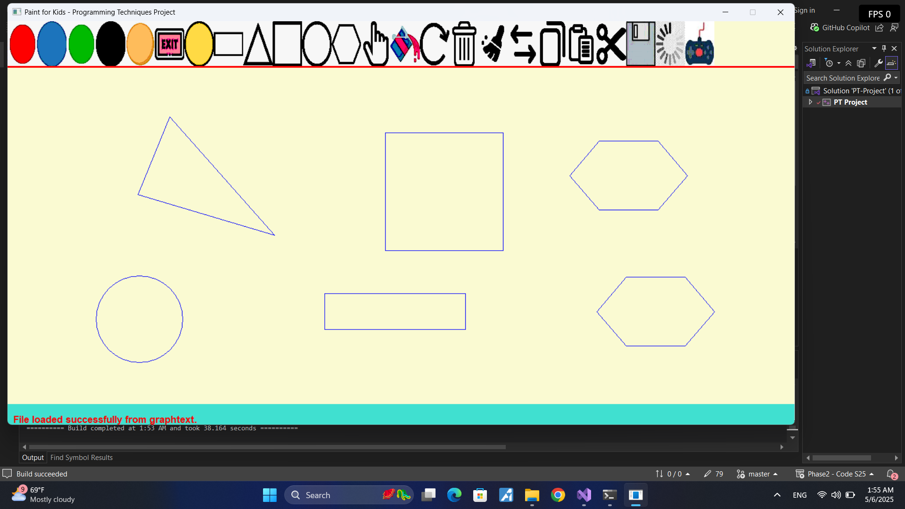
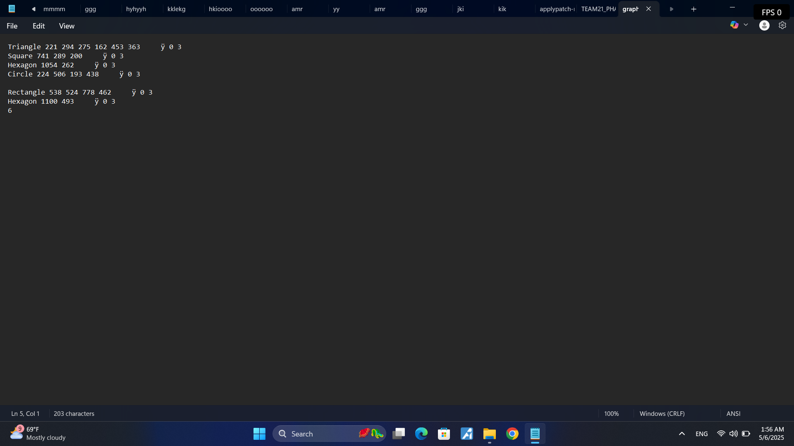

# Paint for Kids

A Windows desktop drawing application written in C++. It provides a toolbar-driven canvas for creating, selecting, editing, saving, and loading geometric figures, with separate draw and play modes.

## Features

- Create rectangles, triangles, squares, circles, and hexagons.
- Set drawing colors and toggle figure fills.
- Select, rotate, delete, clear, and swap figures.
- Copy, cut, and paste selected figures.
- Save drawings to disk and load them in a later session.
- Switch between drawing and play-oriented interfaces.

## Requirements

- Windows 10 or later
- Visual Studio 2022 with the **Desktop development with C++** workload
- MSVC v143 build tools and a Windows 10 SDK

The project includes the required CMU Graphics library source and image assets.

## Screenshots

| Draw mode | Play mode |
| --- | --- |
|  |  |

## Build and run

1. Open `PT-Project.sln` in Visual Studio 2022.
2. Select a build configuration such as `Debug | x64`.
3. Build the solution and start debugging with `F5`.
4. Use the toolbar to draw figures and choose the relevant command to edit, save, load, or change modes.

Keep the `images` directory alongside the executable working directory, because the toolbar uses these image assets.

## Project structure

| Path | Purpose |
| --- | --- |
| `main.cpp` | Application entry point |
| `ApplicationManager.*` | Figure lifecycle and action dispatch |
| `Actions/` | Commands for drawing, editing, persistence, and mode switching |
| `Figures/` | Geometric figure implementations |
| `GUI/` | Input, output, and interface definitions |
| `CMUgraphicsLib/` | Bundled graphics library |
| `images/` | Toolbar and interface assets |

## Notes

This is an academic object-oriented programming project. The design uses an action-based command structure and dedicated classes for each supported figure type.
